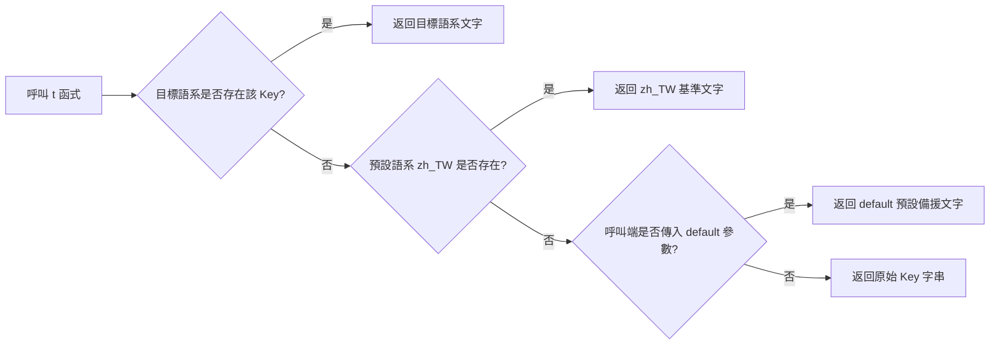

# OpenBastion 多語系架構與在地化維護指引 (Localization & Internationalization Guide)

本目錄存放 OpenBastion 的多語系字典檔。系統啟動時由 `core.i18n` 模組自動掃描並動態載入這層目錄下的所有 JSON 檔，作為終端互動選單 (TUI)、連線動態卡片 (HUD Banner)、管理員命令列 (CLI)、連線閘道通告與安全異常訊息的**單一事實來源 (Single Source of Truth, SSOT)**。

---

## 一、 六大命名空間架構與職責規範 (Namespace Taxonomy)

OpenBastion 採用層級化點號命名空間 (Dot-notated Namespaces) 管理全系統字串，各命名空間職責界定如下：

```
locales/
├── zh_TW.json   # 系統基準語系 (Base SSOT: 正體中文)
├── en_US.json   # 國際通用語系 (International Standard: 美式英文)
└── README.md    # 多語系規格與在地化維護指引
```

| 命名空間 (Namespace) | 適用範圍與職責界定 | 典型鍵值範例 |
| :--- | :--- | :--- |
| **`menu.*`** | 終端 78 欄位雙視圖選單 (TUI)：主標題、表格欄位表頭、視圖切換標籤、搜尋列導航與分頁資訊 | `menu.title`, `menu.col_name`, `menu.nav_bar` |
| **`banner.*`** | 連線成功後之動態 HUD 卡片：目標主機資訊、系統環境、監控採集指標、登入身分映射、組織部門、工單授權與最近登入比對 | `banner.target_host`, `banner.system_env`, `banner.host_status` |
| **`gateway.*`** | SSH-2.0 閘道核心連線生命週期：會話暫掛抽離、接回提示、選單按鍵無效警告、停機前 30 秒平滑廣播通告 | `gateway.session_detached`, `gateway.shutdown_warning` |
| **`cli.*`** | 管理員命令列互動精靈：`--add-host` 主機註冊精靈、`--reset-admin` 密碼重設與主管覆核、`--export-ca` 雙軌 CA 匯出指令 | `cli.add_host_title`, `cli.reset_admin_title`, `cli.export_ca_track1` |
| **`conn_err.*`** | 目標主機底層連線異常抽象：連線拒絕 (Permission Denied)、連線逾時 (Timeout)、通道中斷與失敗診斷 | `conn_err.denied`, `conn_err.timeout`, `conn_err.failed` |
| **`vault.*`** | 憑證保管庫安全防護：金鑰硬體不吻合警示、備份通行碼過短、備份封套毀損與魔術標頭校驗失敗 | `vault.key_mismatch`, `vault.passphrase_too_short`, `vault.envelope_corrupted` |
| **`common.*`** | 跨模組共用之基礎標籤與按鈕：在線/離線狀態標籤、退出動作詞等 | `common.online`, `common.offline`, `common.exit` |

---

## 二、 參數插值語法規範 (Variable Interpolation)

多語系字串支援以花括號 `{variable}` 定義動態替換變數，底層由 `core.i18n.t()` 進行安全代入：

1. **命名約定**：
   - 變數名稱必須保持全小寫字母與底線組合（如 `{hostname}`、`{port}`、`{seconds}`、`{slot}`）。
   - 翻譯人員在新增或潤飾其他語系時，**嚴禁修改或翻譯花括號內部的變數名稱**。
2. **常見插值變數對照表**：
   - `{hostname}`, `{ip}`, `{port}`：目標主機屬性。
   - `{username}`, `{operator}`：操作帳號與登入身分。
   - `{dept}`：所屬組織部門。
   - `{slot}`：暫掛會話槽位編號 (1..3)。
   - `{seconds}`, `{remaining_min}`：時間長度與有效期限。
   - `{ticket_no}`, `{reason}`：特權存取工單號與申請事由。
   - `{error}`：底層原始異常訊息或錯誤代碼。

---

## 三、 多層級容錯降級鏈 (Fallback Chain)

為了杜絕因語系缺少部分鍵值而導致系統拋出異常或空白破版，`core.i18n.t()` 嚴格遵循以下四階降級鏈：



- **Fail-Safe 保證**：任何語系缺漏或翻譯錯誤，均保證系統 100% 正常運作，絕不中斷連線。

---

## 四、 78 欄位安全線與字寬預算 (Character Budget)

為確保在各類終端模擬器（Windows Terminal、PuTTY、xterm、iTerm2、Linux Console）中均能保持置中對齊且不折行破版，全系統文字輸出強制遵守 **78 欄位安全線 (Safety Line)**。

### 1. 視覺寬度計算標準 (East Asian Width)
系統透過 `unicodedata.east_asian_width` 與 ANSI 跳脫序列過濾器 (`core.menu.AnsiSanitizer`) 進行精準測量：
- **半形字元 (Half-width)**：ASCII 英文字母、數字、半形符號，計 **1 欄位寬度**。
- **全形字元 (Full-width)**：繁體中文、日文假名/漢字、全形標點符號，計 **2 欄位寬度**。
- **終端圖標 (Emoji)**：常用終端圖示（💻, 🖥️, 📊, 🌐, 👤, ⏳, 🛡️, 🕒, 🔴, 💡 等），計 **2 欄位寬度**。
- **控制序列**：ANSI 顏色與樣式代碼（如 `\033[1;32m`）、零寬字元，計 **0 欄位寬度**。

### 2. HUD Banner 定寬標題槽 (Fixed-Width Title Slots)
為確保 HUD 卡片的冒號垂直對齊，標題槽採用定寬填充：
- **繁體中文環境 (`zh_TW`)**：標題槽固定為 **11 視覺欄位寬度**，冒號採用全形 `：`。
- **英文環境 (`en_US`)**：標題槽固定為 **17 視覺欄位寬度**，冒號採用半形 `: `。

### 3. TUI 表格欄位字寬預算表 (Character Budget)
| 字典鍵值 (Key) | 建議字寬上限 | 說明與範例 | 超出上限時的處理 |
| :--- | :---: | :--- | :--- |
| `menu.title` | ≤ 74 寬度 | 選單頂部置中標題（如 `OpenBastion 主機選單` 佔 20 寬度） | 超長自動截斷補 `…` |
| `menu.col_index` | ≤ 4 寬度 | 序號欄位標題（如 `#` 佔 1 寬度） | 超長自動截斷補 `…` |
| `menu.col_name` | ≤ 17 寬度 | 主機名稱標題（如 `主機名稱` 佔 8 寬度） | 超長自動截斷補 `…` |
| `menu.col_address` | ≤ 22 寬度 | 端點 IP:Port 標題（如 `IP:埠號` 佔 7 寬度） | 超長自動截斷補 `…` |
| `menu.col_internal_nat` | ≤ 22 寬度 | 內網 NAT 標題（如 `內網NAT` 佔 7 寬度） | 超長自動截斷補 `…` |
| `menu.col_os` | ≤ 15 寬度 | 作業系統標題（如 `作業系統` 佔 8 寬度） | 超長自動截斷補 `…` |
| `menu.col_alias` | ≤ 15 寬度 | 主機別名標題（如 `別名` 佔 4 寬度） | 超長自動截斷補 `…` |
| `menu.col_status` | ≤ 12 寬度 | 狀態標題（如 `狀態` 佔 4 寬度） | 超長自動截斷補 `…` |
| `menu.col_rack` | ≤ 12 寬度 | 機櫃位置標題（如 `機櫃位置` 佔 8 寬度） | 超長自動截斷補 `…` |
| `menu.nav_bar` | **≤ 45 寬度** | 底部左側導航列（包含 `{view}` 替換後的總長） | 與頁碼合併計算，超長截斷 |
| `menu.page_info` | **≤ 25 寬度** | 底部右側頁碼資訊（如 `第 1/1 頁 (共 1 台)` 佔 18 寬度） | 超長右側防護截斷 |

---

## 五、 新增語系標準作業流程 (Auto-Discovery Workflow)

OpenBastion 具備語系自動發現機制，新增語言**無需修改任何一行 Python 程式碼**：

1. **建立字典檔**：
   在 `locales/` 目錄下新增 `<語系代碼>.json`（例如新增日文 `ja_JP.json`）。
2. **填寫 `_metadata` 元資料標頭**：
   在 JSON 最上方定義語系顯示名稱與別名：
   ```json
   {
     "_metadata": {
       "name": "日本語 (Japanese)",
       "aliases": ["ja", "jp", "ja_jp", "japanese"]
     },
     "menu.title": "OpenBastion ホストメニュー",
     "common.online": "オンライン",
     "common.exit": "終了"
   }
   ```
3. **重啟或建立連線**：
   系統啟動時會自動載入該檔案：
   - 使用者可在終端選單輸入 `lang ja` 或 `lang japanese` 即時切換。
   - 輸入 `lang` 或 `lang ?`，新語言會自動列入支援清單與自動自省選單中。

---

## 六、 品質檢核與自動化驗證 (Verification & Testing)

在修改或新增語系後，建議執行專案內建的驗證腳本以確保無破版與缺漏：

```bash
# 1. 執行 AST 靜態審計，確認無硬編碼中文與字典缺口
python scratch/audit_checker.py

# 2. 執行 78 欄位安全線與中英動態 HUD 卡片雙向對齊檢驗
python scratch/verify_i18n_banner.py

# 3. 執行外部語系動態自動發現與切換黑箱測試
python scratch/verify_i18n_external.py
```
